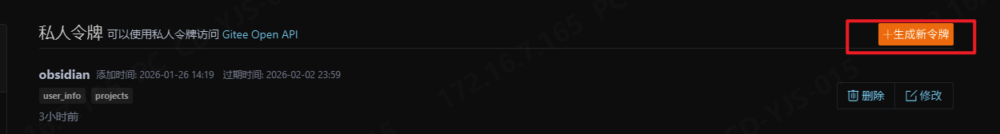

# Gitee Sync

Plugin to sync a Gitee repository with an Obsidian vault.

## Acknowledgements

This plugin is based on and inspired by [GitHub Gitless Sync](https://github.com/silvanocerza/github-gitless-sync) by [Silvano Cerza](https://github.com/silvanocerza), adapted to work with Gitee instead of GitHub. The original plugin provides excellent git-less synchronization for GitHub repositories using REST APIs, and this project adapts that concept for the Gitee platform.

I highly recommend not using this plugin with another sync service.
This might create problems for this plugin when determining what needs to be synced between remote repository and local vault.

## Features

These are the main features of the plugin:

- Desktop and mobile support
- Doesn't require `git`
- Multiple vaults sync
- Automatic sync on fixed interval
- Manual sync
- Conflict resolution view

- Filtering by file type (TODO 🔨)

## Installation

The plugin is available as a community plugin, you can easily search for it in Obsidian and install it from there.

### Issues

If you find any problem please open an issue with as many details as possible.

Please also provide logs if possible, you can copy them from the settings page. Remember to enable logging first.

## Usage

### First sync

> [!IMPORTANT]
> The first sync will only work if either the remote repository or the local vault are completely **EMPTY**. If both contain files the first sync will fail.

You must also configure the plugin settings before syncing.

These settings are mandatory:

- Your Gitee Token (see below)
- Repository owner
- Repository name
- Repository branch

If any of this is not set sync won't start.

### Token

A Gitee personal access token is required to sync with your repository. You can create one by visiting [Gitee Settings → Personal Access Tokens](https://gitee.com/profile/personal_access_tokens).
The token must have the `projects` permission set to access and modify your repository contents.

I also suggest creating the token with access only to your sync repo.

### Sync modes

You can always sync manually by clicking the sync button in the side ribbon.
This will always work even if sync on interval is enabled.

If you don't want to see the button you can hide it, just check the plugin settings.

The `Sync with Gitee` command is also available.

### Conflict resolution

When you sync multiple vaults using this plugin you might risk creating conflicts between the remote and a local vault.
This usually happens when the remote has a new update from vault A, but vault B edits the file before syncing with remote.
That creates a conflict, by default we'll open a view to let you resolve the conflict since you should have all the necessary
information to correctly resolve it.

By default the split view will be used on desktop and the unified one on mobile, you can change the settings to always use the one you prefer.

If you don't want to resolve them you can change the settings to always prefer either the remote or local version in case of conflicts.

### Config sync

If you want to sync your vault configs with other vault you can enable that.
It will sync the whole folder, that is `.obsidian` by default, including all plugins and themes.

Note that the `.obsidian` folder will always be present, this happens because the plugin
needs to store some metadata to correctly sync

> [!CAUTION]
> DO NOT sync configs if your remote repository is public.
> That will expose the token you used to sync.

### Reset

If you need to reset the plugin settings and metadata you can easily do that in the settings.

That will completely wipe all the sync metadata so you'll have to repeat the first sync as if you just enabled the plugin for the first time.

## FAQs

### What's different from other sync plugins?

There are obviously other plugins that let you sync your vault with Gitee or other git hosts, like [`obsidian-git`](https://github.com/Vinzent03/obsidian-git) and [`Obsidian-Gitee-Sync`](https://github.com/kevinmkchin/Obsidian-Gitee-Sync) just to name a couple.

Most of those plugins though require the `git` executable to be present in your system, they might rely on Bash scripts too. This makes them much less portable, it's harder to use on Windows, and mobile is really unstable because most of the times they rely on [`isomorphic-git`](https://isomorphic-git.org/).

This annoyed me because I wanted to have the same experience on every platform, and I wanted especially to support mobile.

So I went a different way and chose to sync **only** with Gitee using their REST APIs, this means I don't rely in anyway on `git` being present in your system. This way I can easily support desktop and mobile with the same identical logic, and some small necessary differences in the UI for a better user experience.

This obviously comes with some limitations. Since `git` is not used you can't interact with your repository locally in any way, and any `git` feature like branching, merging, or rebasing, are not available at all.

Also since this relies only on the Gitee APIs you can only sync with Gitee and no other host.

### Can I use this with other sync plugins?

No.

To work correctly this plugin uses a custom metadata file that is updated every time we sync, if you commit changes outside the plugin that file is not updated properly.

Other plugins don't know about that file, so if you sync with others too you risk losing data.

## Contributing

This is a modified version of the [GitHub Gitless Sync](https://github.com/silvanocerza/github-gitless-sync) plugin adapted for Gitee. For issues or contributions related to the original GitHub plugin, please visit the [original repository](https://github.com/silvanocerza/github-gitless-sync).

For Gitee-specific issues, please check that they are not related to the API differences between GitHub and Gitee before reporting.

## License

The project is licensed under the [AGPLv3](https://www.gnu.org/licenses/agpl-3.0.en.html) license.
